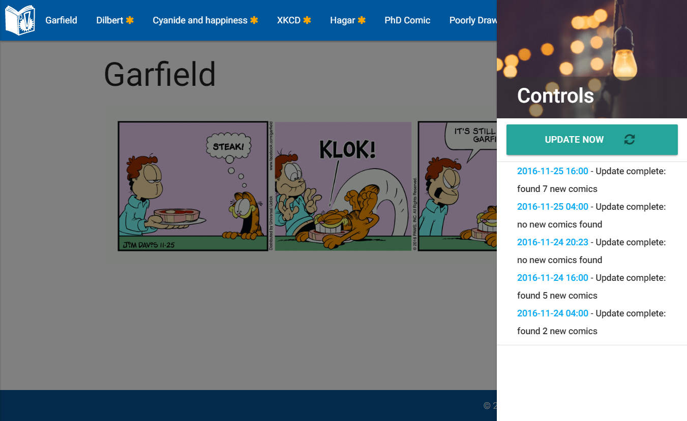

# Flask Comic Collection

Flask Comic Collection runs on a lightweight server (e.g. a raspberry pi) and check if new episodes of your favorite webcomics have been released and combines them into a single website.



## Installation

First get the code from github

    git clone https://github.com/sepro/Flask-Comic-Collection 
    
Go into the directory and set up a virtual environment

    cd Flask-Comic-Collection
    virtualenv --python=python3 venv
    
Next activate the virtual env and install the required python packages

    source venv/bin/activate
    pip install -r requirements.txt
    
Edit the config file

    vim config.py
    
Create a database

    python3 db_action.py create
    
Run the webserver

    python3 run.py
    
Now no webcomics are added so you will be presented a mostly empty screen.

## Adding webcomics

The file sites.json contains the details on which webcomics should be checked. Apart from a name (that will show up in Flask-Comic-Collection) you need to provide the base url, which is where new comics will appear regularly. Furthermore a regex needs to be provided that will pick up the URL of the comic (the image). 

```json
[
  {
    "base_url": "http:\/\/dilbert.com\/",
    "name": "Dilbert",
    "pattern": "\"(http:\/\/assets.amuniversal.com\/.*?)\""
  }
]
```

Defining the pattern is the most difficult thing to do (for more information on how to format a regex, check the documentation for the python re module). The whole pattern needs to match **uniquely** to the part of the site's html code that contains the url to the image. The section in between round brackets **(http:\/\/assets.amuniversal.com\/.*?)** needs to match any url that might appear there. 

You can run the update from the website (if ALLOW_UPDATE is True in config.py). Click the gears in the top right corner, and hit Update comics in the menu that appears.

## Using CRON to update

After activating the virtual environment and configuring sites.json you can update the current comics using

    python3 db_action.py update
    
However, it is recommended to set up a cron job once or twice a day to do this. Add (!) the following line (after updating the paths to match your installation) to */etc/crontab*

    TODO add this
    

## Setting up the a Flask app with a webserver

This will depend on your system, the popular choice is to run nginx as a reverse proxy and use uWSGI or GUnicorn to run the app. There are a number of examples out there

  * [Flask with GUnicorn and nginx](https://www.digitalocean.com/community/tutorials/how-to-serve-flask-applications-with-gunicorn-and-nginx-on-ubuntu-16-04)
  * [Flask uWSGI and nginx](https://www.digitalocean.com/community/tutorials/how-to-serve-flask-applications-with-uwsgi-and-nginx-on-ubuntu-14-04)
  * [uWSGI, nginx on rapsberry pi](http://www.pratermade.com/2014/08/setting-up-your-raspberry-pi-environment/)

## Acknowledgements

  * The talented artists putting effort in webcomics, thanks for making the internet awesome!

  * Front end libraries
    * [Materialize](http://materializecss.com/)
    * [Font Awesome](http://fontawesome.io/)
    * [JQuery](https://jquery.com/)

  * Server side
    * [Flask](http://flask.pocoo.org/)

  * Images used under Creative Commons License by
    * [Alex Holyoake](https://stocksnap.io/photo/O9T7NGXHQR)
    * [Ferdinand Stöhr](https://stocksnap.io/photo/3260OXMZZX)
    * [Josh Byers](https://stocksnap.io/photo/QDXWH4M6K1)
    * [Bara Cross](http://www.bara-art.com/manga-room-divider/)
    * [Carlo Cariño](https://thenounproject.com/search/?q=comic&i=7433)
